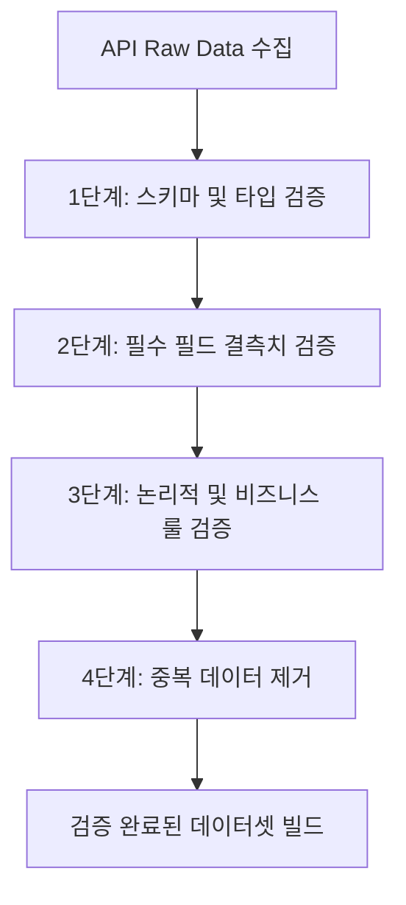

# 숭실대학교 대학가 주거 환경 분석 프로젝트 명세서 (데이터 수집 및 검증 단계)

본 명세서는 숭실대학교 인근의 대학가 주거용 부동산(원룸, 오피스텔, 빌라 등) 전월세 데이터를 분석하기 위해 필요한 **데이터 수집 및 검증 단계**의 구체적인 계획과 기준을 정의합니다. 데이터 가공(K-Means 군집화, 데이터 정규화 등) 이전 단계까지를 범위로 합니다.

---

## 1. 어디에서 데이터를 추출해올 것인가? (데이터 수집 출처)

데이터의 신뢰성, 정밀도 및 법적 안전성을 확보하기 위해 **공공데이터포털(data.go.kr)에서 제공하는 국토교통부 실거래가 오픈 API**를 활용하여 원천 데이터를 수집합니다.

### 1.1 수집 대상 API
분석 대상이 되는 매물 유형에 따라 아래 세 가지 API를 통합 연계하여 수집합니다.
1. **국토교통부_단독/다가구 전월세 실거래자료 조회 서비스**
   - 일반적인 원룸 및 다가구 주택의 전월세 거래 내역을 수집합니다.
2. **국토교통부_오피스텔 전월세 실거래자료 조회 서비스**
   - 최근 대학생들이 선호하는 주거 형태 중 하나인 오피스텔의 전월세 거래 내역을 수집합니다.
3. **국토교통부_연립다세대 전월세 실거래자료 조회 서비스**
   - 빌라, 다세대주택 등 대학가 근처의 연립주택 전월세 거래 내역을 수집합니다.

### 1.2 요청 파라미터 구성
API를 호출할 때 필수적으로 입력해야 하는 요청 인자(Request Parameters)는 다음과 같이 설정합니다.
- `serviceKey`: 공공데이터포털에서 발급받은 인증키 (인코딩/디코딩 키 구분 적용)
- `LAWD_CD`: 법정동 코드 앞 5자리 (지역구 단위)
  - 동작구: `11590` (숭실대학교 소재구)
  - 관악구: `11620` (인접 생활권)
- `DEAL_YMD`: 계약년월 (6자리, YYYYMM 형식)

---

## 2. 어떤 기준으로 추출할 것인가? (수집 및 추출 기준)

숭실대학교 대학가 주변의 실제 대학생 거주 환경을 대변할 수 있도록 데이터를 공간적, 물리적, 시간적 기준으로 필터링하여 추출합니다.

### 2.1 공간적 기준 (법정동 필터링)
숭실대학교(서울시 동작구 상도동) 반경 도보 통학 및 인접 생활권을 기준으로 데이터를 필터링합니다.
- **1순위 (핵심 통학권 - 동작구)**:
  - 상도동 (법정동 코드: `1159010200`)
  - 상도1동 (법정동 코드: `1159010300`)
- **2순위 (인접 생활권 - 동작구/관악구)**:
  - 사당동 (법정동 코드: `1159010700` - 7호선 라인 및 숭실대 인근 사당 권역)
  - 봉천동 (법정동 코드: `1162010100` - 숭실대 후문 및 서울대입구역 인근 권역)

### 2.2 매물 규모 및 성격 기준 (물리적 기준)
대학생 1인 가구가 거주하는 소형 주택 및 원룸 중심의 분석을 위해 매물 크기를 제한합니다.
- **전용면적 기준**: `전용면적(㎡) <= 40㎡` (약 12평 이하의 소형 평수 매물만 추출)
- **거래 유형**: 임대차 분석이 목적이므로 매매 거래를 제외한 **전세 및 월세** 거래 정보만 추출

### 2.3 시간적 기준 (추출 기간)
계절성 요인(신학기 시작 전 거래 집중)과 연도별 임대료 변화 추이를 충분히 반영할 수 있도록 장기 시계열 데이터를 확보합니다.
- **기간**: `2021년 1월 1일 ~ 현재(2026년 5월)` 계약 건 (최근 약 5개년 데이터)

---

## 3. 이를 어떻게 검증할 것인가? (데이터 검증 방안)

수집된 원시 데이터(Raw Data)의 결함과 왜곡을 방지하기 위해 4단계의 검증 파이프라인을 가동하여 최종 데이터셋을 구축합니다.

### 3.1 스키마 및 데이터 타입 검증 (Schema & Type Validation)
- API 응답 데이터(XML/JSON)가 사전 정의된 구조를 준수하는지 확인합니다.
- 보증금액, 월세금액, 전용면적, 건축년도 등 수치 연산에 활용되는 변수들이 올바르게 숫자형(`int`, `float`)으로 파싱되었는지 검증합니다. (예: 문자열 내의 콤마`,` 제거 후 정수 변환 등)

### 3.2 필수 필드 결측치 검증 (Missing Value Detection)
- 아래의 핵심 분석 필드에 결측치(Null, Empty String, NaN)가 포함된 레코드를 감지합니다.
  - `보증금액`, `월세금액`, `전용면적`, `법정동`, `계약년월`
- **조치**: 핵심 분석 필드에 결측치가 포함된 레코드는 분석 품질 저하를 막기 위해 데이터셋에서 제외하고 에러 로그를 남깁니다.

### 3.3 논리적 일관성 검증 (Logical Consistency Validation)
상식적인 부동산 거래 범위를 벗어나는 데이터 오류를 방지하기 위해 비즈니스 룰 검증을 수행합니다.
- **금액 일관성**: `보증금액 >= 0` 및 `월세금액 >= 0` 검증 (음수 금액 제거)
- **면적 일관성**: `전용면적 > 0` 검증
- **날짜 일관성**: `건축년도 <= 계약년도` 검증 (건물이 지어지기 전에 거래가 일어나는 데이터 오류 제거)
- **층수 정보 예외 처리**: `층` 정보 중 지하층(반지하 등)은 `-1` 또는 음수 값으로 올바르게 변환되었는지 검증 및 통일 처리

### 3.4 중복 데이터 제거 (Deduplication)
- 동일한 매물에 대해 공공데이터 API 업데이트 주기 등으로 인해 중복 수집된 데이터가 존재할 수 있습니다.
- **기준**: `[법정동, 지번, 전용면적, 계약년월, 계약일, 보증금액, 월세금액, 층]`이 100% 일치하는 데이터는 중복 데이터로 규정하고 최신의 1건만 남기고 제거합니다.

---

## 4. 이는 가능한 것인가? (실현 가능성 검토)

### 4.1 기술적 실현 가능성 (Technical Feasibility): 매우 높음
- 국토교통부 오픈 API는 공공데이터포털에서 상시 제공하는 표준 REST API로, Python의 `requests` 라이브러리를 사용해 손쉽게 데이터를 수집할 수 있습니다.
- 반환되는 데이터는 구조화된 XML/JSON 포맷이므로, Python `pandas` 라이브러리를 통해 상기 정의한 필터링 기준과 검증 로직을 높은 성능으로 실행할 수 있습니다.
- API 일일 호출 제한(보통 1,000~10,000회)은 동작구와 관악구의 5개년 데이터를 조회하는 데 소요되는 호출 수(계약년월 기준 약 60개월 * 2개 구 = 120회 내외)에 비해 매우 여유롭습니다.

### 4.2 법적 실현 가능성 (Legal Feasibility): 문제 없음 (완전 합법)
- 공공데이터포털을 통해 제공되는 국토교통부 실거래 정보는 국가가 공익적 활용 및 서비스 개발을 위해 공식 개방한 데이터입니다.
- 포털 이용 약관 및 공공데이터법에 의거하여 상업적/비상업적 이용 및 데이터 가공이 전면 허용되어 있습니다.
- 민간 플랫폼(네이버 부동산, 직방 등)을 무단 크롤링할 때 우려되는 **데이터베이스권 침해 및 부정경쟁행위 리스크가 전혀 없습니다.**

### 4.3 데이터 충분성 (Data Sufficiency): 매우 충분
- 동작구 상도동 및 관악구 봉천동 지역은 서울 시내에서도 1인 가구 및 청년층 원룸 거래가 가장 활발한 대표적인 대학가 밀집 지역입니다.
- 연도별/월별 실거래 데이터 건수가 수천 건 이상 확보 가능하여, 이후 데이터 가공 단계에서 안정적인 분석 및 통계 모형 설계가 가능합니다.
